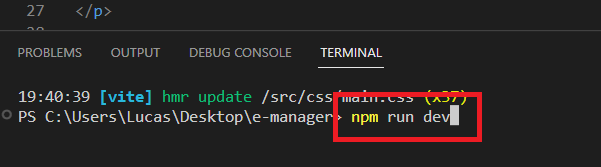

# Sobre o projeto

O projeto consistiu em realizar um desafio proposto pela Union Developers. A Union Developers é uma empresa que reune desenvolvedores juniors para proporcionar um ambiente prático e imersivo, semelhante ao que você encontrará no mercado de trabalho.

No desafio foi fornecido as seguintes instruções:

### Objetivo

Construir uma aplicação web para controle de estoque de produtos.

### Layout

<a href="https://www.figma.com/file/lFQtZ0pAKLBY5a4PqGo46y/Challenges-Union---e-manager?type=design&mode=design&t=aILXLawkOb8WgIzf-0">Layout do figma</a>.

### Requisitos funcionais

- Deve ser possível criar um produto.
- Deve ser possível editar um produto.
- Deve ser possível remover um produto.
- Deve ser possível pesquisar produtos pela barra de pesquisa.

### Requisitos não funcionais

-  Deve ser utilizado `React`.
-  Deve ser utilizado `Typescript`.
-  Deve ser utilizado `SCSS`.
-  A aplicação deve ser `responsiva`.
-  Realize comunicação entre componentes utilizando `props`.
-  Utilize o `React Router` para criar rotas e permitir a navegação entre páginas.
-  Todos os elementos visuais devem ser criados do zero, não utilizar frameworks como `Bootstrap`.
-  Deve ser utilizado `commits semânticos`.
-  Deve ser utilizado `commits atômicos`.

### Regras de negócio

-  Deve ser utilizado o seguinte backend:
<a href="https://github.com/union-developers-group/e-manager-backend">Link do repositório do backend</a>.
  Para salvar, editar e remover os produtos.
-  O preço deve ser formatado para o formato real brasileiro.
-  Os dados devem ser validados antes de ser enviado para a API.

## Video do projeto

<a href="https://studio.youtube.com/video/9eQrSydi5WA/edit">Video do projeto aqui</a>.

## Linguagens utilizadas

Typescript | React | HTML | SASS

## Como instalar

Para preparar o ambiente, precisaremos ter algumas coisas instaladas no computador, sendo elas:

Node.js
<a href="https://nodejs.org/pt-br">Clique aqui para instalar o Node.js</a>.

Para instalar o Node, clique no link e baixe a versão LTS (versão recomendada)
Para verificar se foi instalado corretamente, abra o terminal e escreva node -v ou node --version
alt text: site do Nodejs, com o botão da versão recomendada em foco por um quadrado vermelho!

Git
<a href="https://git-scm.com/download/windows">Clique aqui para instalar o Git</a>.

Caso não tenha um terminal de preferência, recomendo utilizar o git bash. Para instalá-lo, haverá uma opção durante a instalação do git para permitir instalar o git bash
alt text: imagem mostrando várias caixas selecionáveis. A caixa “Git Bash Here” está em evidência por um quadrado vermelho com uma seta apontada para ele

Para verificar se o git foi instalado corretamente, abra o terminal e escreva git --version
Visual Studio Code

Entre no link e baixe a versão de Windows.

<a href="https://code.visualstudio.com/download">Clique aqui para instalar o Visual Studio</a>.

Clique com o botão direito em algum local do computador e selecione a opção Git Bash Here.

Escreva no terminal o comando abaixo e no lugar de 'cole aqui' entre no projeto do GitHub e cole o link do projeto.

git clone 'cole aqui o link do projeto'

Uma pasta com o projeto desejado será adicionada a pasta em que foi escolhida.
Clique com o botão direito em cima da pasta e selecione "Abrir com Code"

Uma vez que o Visual studio estiver aberto com o projeto desejado, abra o terminal clicando no menu da aba superior e digite no terminal aberto o código "npm install" e logo em seguida digite "npm start". Uma janela do browser será aberta e o projeto será iniciado em seu computador.

 

# :sunglasses: Autor 

 

Lucas Santana Figueiredo

 
  
  
  

